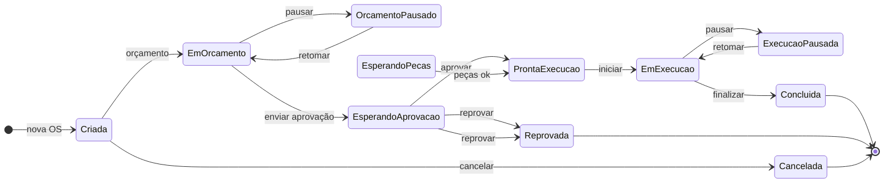

# Manual do Usuário — Engenharia Clínica (engc_os)

Este manual descreve o uso do módulo **Engenharia Clínica** (engc_os) no Odoo. O conteúdo está restrito às funcionalidades presentes no código do módulo.

---

## 1. Visão geral do módulo

- **Nome:** Engenharia Clínica (engc_os).
- **Resumo:** Gestão de ordens de serviço, equipamentos, manutenções preventivas, calibrações e relatórios de atendimento em engenharia clínica.
- **Menu principal:** **Engenharia Clínica**, acessível na barra de menus do Odoo.
- **Submenus:** Serviços, Preventivas, Equipamentos, Calibração e Ensaios, Relatórios, Configurações.

---

## 2. Serviços

**Onde acessar:** Engenharia Clínica → Serviços.

### 2.1 Solicitação de Serviço

- **Onde clicar:** Serviços → **Solicitação de Serviço**.
- **Finalidade:** Registrar uma solicitação de serviço (requisitante, departamento, equipamentos, técnico, prioridade) e, a partir dela, gerar ordem(s) de serviço (OS).
- **Ações principais:** Criar solicitação; usar o botão/ação para **Gerar OS** a partir da solicitação.

### 2.2 Ordens de Serviço

- **Onde clicar:** Serviços → **Ordens de Serviço**.
- **Estados da OS:** Criada → Em Orçamento → Orçamento Pausado → Esperando aprovação → Esperando peças → Pronta para Execução → Em execução / Execução Pausada → Concluída (ou Reprovada / Cancelada).
- **Campos principais:** Instituição, Cliente, Equipamento, Tipo de manutenção (Corretiva, Preventiva, Instalação, Treinamento, Preditiva, Qualificação, Comodato, Calibração), Manutenção (Própria/Terceirizada), Prioridade, Data Requisição, Data Programada, datas de execução, Garantia, Checklist, Relatórios de atendimento, Peças.
- **Ações principais:** Gerar checklist a partir do plano da categoria do equipamento; abrir Checklist; abrir Relatórios de Atendimento; Adicionar relatório; abrir Requisição de peças; Aprovar orçamento; Reprovar orçamento; Aguardar peças; Iniciar execução; Pausar/Retomar execução; Concluir execução; imprimir OS, Checklist em branco, Relatório de Atendimento em branco (ações de impressão na ficha da OS).

### 2.3 Relatórios de Atendimento

- **Onde clicar:** Serviços → **Relatórios de Atendimento**.
- **Finalidade:** Registrar cada atendimento vinculado a uma OS (tipo, datas, estado do equipamento, checklist do atendimento, resumo, peças, fotos).
- **Campos principais:** OS (obrigatório), Tipo de relatório (Orçamento, Manutenção, Instalação, Treinamento, Calibração, Qualificação), Estado do equipamento (Parado, Funcionando, Funcionando com restrições), datas de atendimento, itens do checklist, resumo do atendimento, peças solicitadas, fotos.
- **Ações principais:** Atualizar resumo a partir do checklist; adicionar/remover itens do checklist; abrir requisição de peças; aplicar peças; Concluir; Cancelar.

---

## 3. Preventivas

**Onde acessar:** Engenharia Clínica → Preventivas.

### 3.1 Listar Preventivas

- **Onde clicar:** Preventivas → **Listar Preventivas**.
- **Estados:** Criada, Cancelada, Atrasada, Ordem Gerada, Reagendada, Concluída.
- **Campos principais:** Equipamento, Cliente, Cronograma, Plano de manutenção, Periodicidade, Técnico.
- **Ação principal:** Gerar OS a partir da preventiva.

### 3.2 Cronogramas

- **Onde clicar:** Preventivas → **Cronogramas**.
- **Finalidade:** Visualizar e imprimir cronogramas de preventivas.
- **Relatórios disponíveis:** Cronograma de Preventiva (vinculado ao cronograma); Cronograma de Preventivas do Equipamento (vinculado ao equipamento).
- **Wizard de impressão:** Permite selecionar um cronograma e a opção **Incluir Planos de Manutenção** para gerar o PDF do Cronograma de Preventiva (Wizard).

### 3.3 Planos de Manutenção

- **Onde clicar:** Preventivas → **Planos de Manutenção**.
- **Estados:** Criado, vigente, obsoleto.
- **Estrutura:** Seções, Periodicidades, Instruções (com tempo, tipo de campo, medição quando aplicável).
- **Wizard:** **Copiar Plano de Manutenção** — copiar periodicidades, seções e instruções sem seção de outro plano para o plano atual.
- **Relatório:** Impressão do Plano de Manutenção (ação na ficha do plano).

---

## 4. Equipamentos

**Onde acessar:** Engenharia Clínica → Equipamentos.

### 4.1 Equipamentos

- **Onde clicar:** Equipamentos → **Equipamentos**.
- **Status:** Em uso, Fora de uso, Inservível.
- **Campos principais:** Categoria, Cliente, Técnico, Equipe de Manutenção, Departamento, Local de Uso, Marca, Modelo, Número de Série, Reg Anvisa, Patrimônio, Garantia, Próxima Manutenção Preventiva, Frequência de Manutenção.
- **Relatório:** Cronograma de Preventivas do Equipamento (ação na ficha do equipamento).

### 4.2 Categorias

- **Onde clicar:** Equipamentos → **Categorias**.
- **Finalidade:** Cadastrar categorias de equipamentos e associar plano de manutenção; instruções de manutenção por categoria (grupos, tempo de duração, medição, tipo de campo) são gerenciadas no modelo de instruções vinculado à categoria.

---

## 5. Calibração e Ensaios

**Onde acessar:** Engenharia Clínica → Calibração e Ensaios.

### 5.1 Calibrações

- **Onde clicar:** Calibração e Ensaios → **Calibrações**.
- **Estados:** Rascunho, Em andamento, Concluída.
- **Campos principais:** Ordem de Serviço, Cliente, Equipamento, Técnico, Data Calibração, Próxima Calibração, Instrumentos padrão, Norma/Procedimento, medidas (cód. medidas), Condições ambientais, Data de Emissão.
- **Relatório:** Impressão de Certificado de Calibração (ação na ficha da calibração).

### 5.2 Procedimentos de Medição e Instrumentos

- **Onde clicar:** Calibração e Ensaios → **Procedimentos de Medição** e **Instrumentos**.
- **Finalidade:** Cadastros usados nas calibrações (normas/procedimentos de medição e instrumentos padrão).

---

## 6. Relatórios (menu e ações)

**Onde acessar:** Engenharia Clínica → Relatórios.

### 6.1 Resumo de Relatórios de Atendimento

- **Onde clicar:** Relatórios → Atendimentos → **Resumo de Relatórios de Atendimento**.
- **Uso:** Abre um assistente (wizard) em que o usuário informa Data Início, Data Fim e, opcionalmente, Equipamento e Status. Ao confirmar, é gerado o PDF **Relatório Resumido de Atendimentos**.

### 6.2 Relatórios vinculados a registros

| Registro        | Nome do relatório / ação                                      |
|-----------------|---------------------------------------------------------------|
| Ordem de Serviço | Impressão de Ordem de serviço                                |
| Ordem de Serviço | Checklist em branco                                          |
| Ordem de Serviço | Relatório de Atendimento em Branco                           |
| Plano de Manutenção | Relatório de Plano de Manutenção                         |
| Cronograma (preventiva) | Cronograma de Preventiva                               |
| Cronograma (wizard) | Cronograma de Preventiva (Wizard) — via wizard de impressão |
| Equipamento      | Cronograma de Preventivas do Equipamento                     |
| Calibração      | Impressão de Certificado de Calibração                        |

---

## 7. Configurações

**Onde acessar:** Engenharia Clínica → Configurações.

Cada item abaixo abre a lista/formulário do respectivo cadastro:

- **Unidades de Medida (Calibração)** — Unidades de Medição para calibração.
- **Meios de Aquisição** — Meios de Aquisição de Equipamentos.
- **Departamento Equipamentos** — Departamentos para equipamentos.
- **Equipes de Manutenção** — Equipes de manutenção (crie e gerencie equipes de manutenção).

---

## 8. Regras e validações (extraídas do código)

- **Ordem de Serviço:** Data Requisição não pode ser maior que Data Programada; Data Requisição não pode ser maior que Início da Execução; Início da Execução deve ser anterior ao Término da Execução. Para tipo de manutenção **Preventiva**, a Periodicidade é obrigatória. Não é possível criar relatório de atendimento em uma OS concluída.
- **Relatório de Atendimento:** A OS é obrigatória para criar um relatório; não é possível criar relatório em OS concluída; não é possível adicionar ou alterar itens (checklist, fotos, etc.) em relatório cancelado.
- **Calibração:** A data de calibração não pode ser maior que a data da próxima calibração.
- **Wizard Resumo de Relatórios de Atendimento:** Data Início deve ser anterior à Data Fim.

---

## Diagrama de fluxo — Ordem de Serviço

Fluxo de estados da Ordem de Serviço (referência visual):

---

*Documentação restrita ao que existe no código do módulo engc_os (menus, modelos, relatórios, wizards e validações).*
